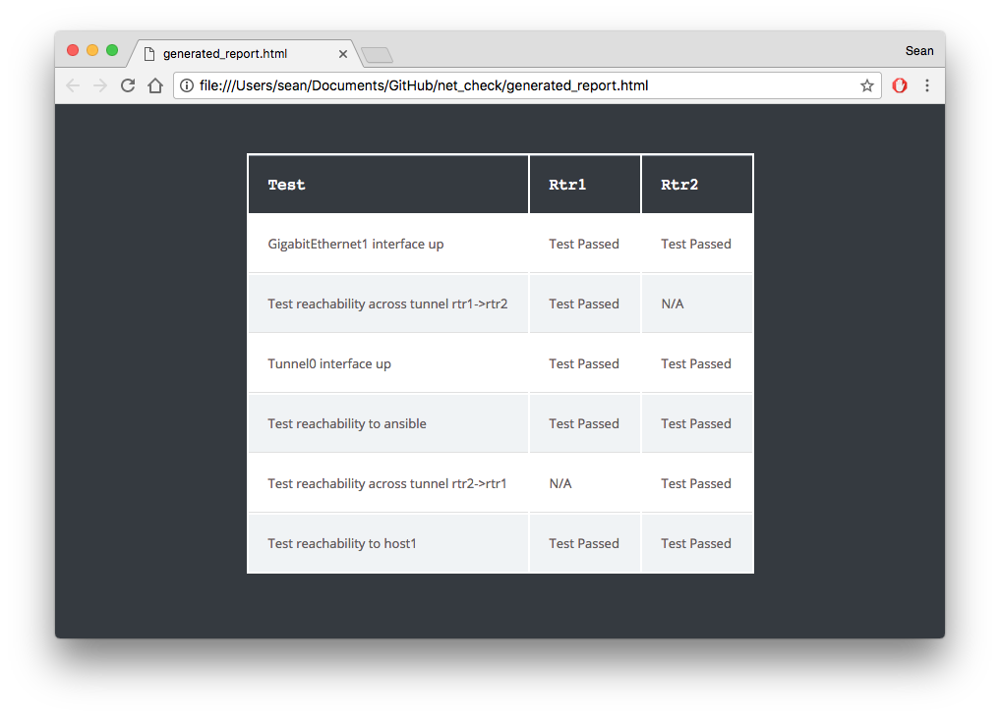
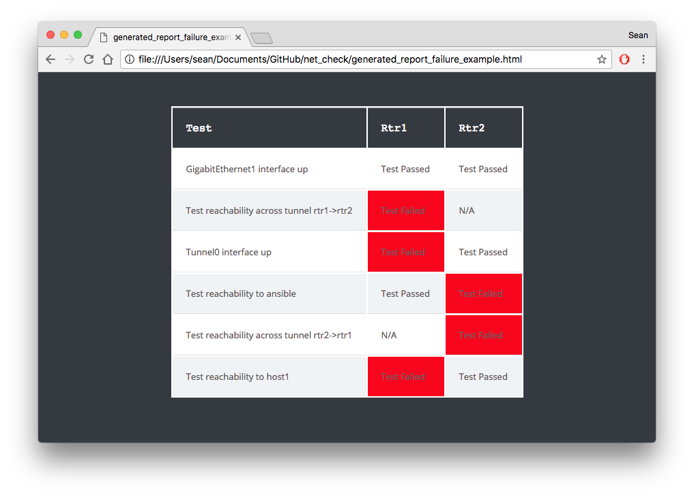

# Example of Checking Network State
One of the many use cases for Ansible and the [networking modules](http://docs.ansible.com/ansible/latest/list_of_network_modules.html) is to check the state of the network.  This is different than configuring networking platforms in that you are checking what was configured versus just providing a configuration.  

For example a Playbook can  be written to configure an ethernet port up, but the Playbook doesn't guarantee that a physical cable is plugged in and the other side is also up.  However, we can also write a playbook to actually check that the port is up, not just configured.

## The playbook
Here is one task (out of 7 total tasks) from the playbook shown for demonstration purposes:

```
---
- hosts: routers
  gather_facts: no
  connection: local
  vars:
    ansible_network_os: ios
  tasks:
    - name: GigabitEthernet1 interface up
      net_interface:
        name: GigabitEthernet1
        state: up
      register: test1
      ignore_errors: yes
```

Breaking apart the task here is what each parameter does:

```
      net_interface:
```
- *net_interface* This calls the [net_interface](https://docs.ansible.com/ansible/latest/net_interface_module.html) networking module.
```
        name: GigabitEthernet1
```
- *name:* This is what the networking platform calls the interface, this is dependent on the vendor naming schema and must match what you see from cli commands.  This means this task will execute against GigabitEthernet1
```
        state: up
```
- *state* This parameter has 4 valid choices: present, absent. up and down.  The parameter up means not only is the switch configured with the port as admin up (`no shut`), but that the port actually is administratively AND physically up (protocol up).
```
      register: test1
```
- *register* - the [register parameter](http://docs.ansible.com/ansible/latest/playbooks_conditionals.html#register-variables)  stores the result of a given task.  In this case we use the registration to build a table of results.  
```
      ignore_errors: yes
```
- *ignore_errors* is a parameter for [error handling](http://docs.ansible.com/ansible/latest/playbooks_error_handling.html).  In default Ansible behavior if a task fails the playbook will end for the particular node it failed on.  In this case the failure will be ignored and the playbook will continue onto the next task.  This allows all the tasks to be run and a report can be generated for which tasks failed and which ran.

## Network Diagram
This playbook is written for the [Networking Lightbulb Workshop](https://github.com/network-automation/lightbulb/) which has the following diagram:
.

## The checks
| Test       | Description                                  |
| ---------- |:---------------------------------------------|
| test1      | GigabitEthernet1 interface up                |
| test2      | Tunnel0 interface up                         |
| test3      | Test reachability across tunnel rtr1->rtr2   |
| test4      | Test reachability across tunnel rtr2->rtr1   |
| test5      | Test reachability to ansible node            |
| test6      | Test reachability to host1                   |

## Running the playbook

Use the `ansible-playbook` command:
```
$ ansible-playbook net_lightbulb.yml
```
This will generate a report called generated_report.html in the local folder (where the playbook was run from.

## Example Passed Tests


## Example Failed Tests


 ---


Red Hat® Ansible® Automation includes three products:

- [Red Hat® Ansible® Engine](https://www.ansible.com/ansible-engine): a fully supported product built on the foundational capabilities of the Ansible project.

- [Red Hat® Ansible® Networking Add-On](https://www.ansible.com/ansible-engine): provides support for select networking modules from Arista (EOS), Cisco (IOS, IOS XR, NX-OS), Juniper (Junos OS), Open vSwitch, and VyOS.

- [Red Hat® Ansible® Tower](https://www.ansible.com/tower): makes it easy to scale automation, manage complex deployments and speed productivity. Extend the power of Ansible with workflows to streamline jobs and simple tools to share solutions with your team.

Want more info?
[Read this blog post for more info about Engine, the networking add-on and Tower](https://www.ansible.com/blog/red-hat-ansible-automation-engine-vs-tower)
